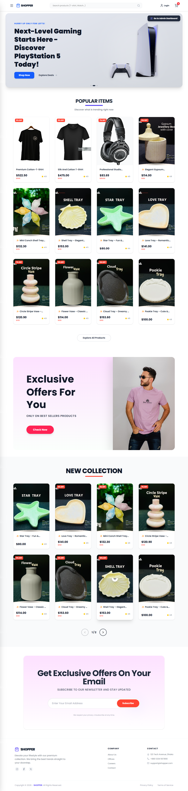

# 🛒 Shopper – Modern Mid-Scale E-Commerce Platform (MVP)

Shopper is a high-performance, single-store e-commerce application built with a production-grade **PERN** stack (PostgreSQL, Express, React, Node.js). It is engineered as a clean monorepo to solve critical e-commerce challenges such as infinite hierarchical nested categories, dynamic product variants, automated stock synchronization, and bulletproof relational data consistency.

---

## 🌐 Live Demo
- **Frontend:** [https://shahadat-ecommerce.netlify.app](https://shahadat-ecommerce.netlify.app)
- **Backend:** [https://e-commerce-server-ma9a.onrender.com](https://e-commerce-server-ma9a.onrender.com)

> **Note:** The server is hosted on a free Render tier. If it's inactive, please allow **30-60 seconds** for the initial server "cold start" to complete before interacting with the application.

---

## 📸 Screenshots

### ☀️ Customer View (Light Mode)


### 📦 Admin Inventory Management


### 🗂️ Dynamic Nested Category UI


### 📱 Responsive Mobile View


---

## ✨ Key Features & Architectural Capabilities

### 🛍️ Comprehensive Storefront & Product Administration
* **🗂️ Production-Level Nested Categories:** Powered by an infinite self-referencing hierarchical tree, allows adding deeply nested subcategories under any level. Driven via a recursive dropdown component syncing selected pathways dynamically in the UI.
* **👕 Multi-Attribute Variant Matrix & Dynamic UPSERT:** Supports flexible product options (e.g., Size, Color) mapping out to independent price modifiers, distinct unique child SKUs, and localized inventory tracking.
* **📦 Hybrid Inventory Topologies:** Features a unified toggleable administration sync model. Easily handles flat product structures (single-item inventory) and dynamically converts them to high-density multi-tier variant pools while executing deep integrity checks.
* **🔍 Isomorphic URL-Driven Search & Filtering:** Synchronizes client-side product discovery filters (`Category`, `Sort Matrices`, and `Dynamic Search Inputs`) directly with the browser's URL search parameters. This structure facilitates robust deep-linking, ensures zero state-loss on manual page reloads, and acts as the single source of truth for downstream API query parameters.
* **🛒 Atomic Guest Checkout & Order Lifecycle Management:** Integrated with a highly optimized guest checkout system managed via high-performance reactive states and standalone forms. Features instant state transitions across transactional modals to processing-guards, ensuring a zero-friction purchase pipeline.
* **⚡ Reactive Multi-Query Invalidation:** Harmonizes persistent client-side caching managed via **Zustand UI hooks** with automated background cache bursting via **TanStack Query mutations**, instantly refetching dashboard indicators, product lists, and core parameters.
* **📱 Unified Micro-Responsive Interface:** Engineered with responsive grid layers, smooth loading sequences via Lucide components, and independent module partitions optimized for heavy storefront and administrative interactions.

---

### ⚙️ Core Engineering Architecture (Deep-Dive)

#### 1. Advanced Structural UPSERT Loops & Referential Integrity Guards
Managing complex product schemas across highly coupled structural tables requires zero-fault isolation layers to defend financial and physical tracking records:
* **The Business Dilemma:** Deleting products or changing variants associated with historical customer transactions destroys backend consistency, breaking active client invoices, metrics calculations, and tracking history.
* **The Strategy:** Outfitted with an active lookup interceptor targeting `order_items` inside the relational system. Any batch update (`handleSyncProductVariants`) or strict deletion (`handleDeleteProduct`) that flags active target identifiers throws a `409 Conflict` boundary, safeguarding transactional structures before cascading actions.

#### 2. ACID-Compliant Transactional Order Orchestration Engine
Securing financial checkout actions against dirty reads, half-written data payloads, and structural mutations utilizes a strict database routing setup:
* **Relational Payload Isolation:** Wraps individual entry pipelines (`handleCreateOrder`) securely within explicit connection clients from the PostgreSQL pool using native `BEGIN`, `COMMIT`, and `ROLLBACK` boundaries. If main catalog registration steps (`orders`) or deep structural loops (`order_items`) experience failure, the database engine executes an immediate snapshot rollback.
* **Non-Blocking Promise Aggregation:** Bypasses sequential execution bottlenecks inside iteration blocks by using asynchronous `Promise.all()` structures. The system dispatches multiple child-row operations simultaneously to the multi-threaded query compiler, minimizing network database roundtrips.

#### 3. High-Concurrency Stock Race-Condition & Deduction Defenses
Multi-user product updates present major consistency challenges when multiple requests attempt to claim identical limited stock metrics concurrently:
* **Inline State Atomic Constraints:** Eradicates race-conditions at the query level during order completion steps (`handleUpdateOrder`). The stock modifier forces atomic processing parameters directly inside the core mutation block, executing: `UPDATE inventory SET quantity = quantity - $1 WHERE product_variant_id = $2 AND quantity >= $1;`
* **Boundary Validation & Rollbacks:** Employs precise row-count evaluations (`result.rowCount === 0`) right after bulk updates run. If a query finds a variant doesn't exist or flags insufficient stock, the system breaks out of execution and throws a `400 Bad Request` state error. This cancels downstream operations, like incrementing `sold_count`, and triggers a full database rollback.

#### 4. Hardware-Native Media CSS Print Engine for Administrative Invoicing
Delivers clean administrative order reports directly inside customer-facing components without requiring expensive client-side PDF compilers or external rendering dependencies:
* **Media-Query Print Interception:** Employs structural utility layers using Tailwind's hardware-native `hidden print:block` layout boundaries. The UI dynamically isolates administrative components entirely from standard viewport screens while auto-formatting high-fidelity invoices (`InvoicePrint`) for real-world document processing or structural system-native OS print views.
* **Dynamic Relational Reconstruction:** Maps historical raw payment values, nested sub-item matrix variants, string-interpolated Mono-SKUs (`final_sku`), and granular shipping/subtotal pricing parameters into structured tables, preventing design alignment breaking across active print layouts.

#### 5. Cross-Cloud Distributed Assets & Post-Fail Storage Reclamation
Handling hybrid binary form payloads alongside database record modification poses serious challenges, as failed operations often leave orphan files consuming cloud storage:
* **Parallel Execution Engine:** Employs multi-stream multipart processing, uploading main covers and sub-image collection arrays concurrently via native `Promise.all()` structures directly onto Cloudinary targets without locking backend execution threads.
* **Storage Garbage Collector:** To solve database-abort discrepancies, the interceptor registers newly committed file tracks inside an active tracking array. If an entity validation or database constraint breaks after images reach cloud storage, the application captures the exception and dispatches automated asynchronous `cloudinaryFileDelete` threads, cleaning orphan assets instantly.

#### 6. Automated Algorithmic SKU & Collision-Free SEO Slug Pipelines
Bypasses manual metadata administration by computing strict, structured identifiers directly inside the request controller layers:
* **Deterministic SKU Compiling:** Combines primary corporate product codes with string mutations and auto-generated variants. For multi-attribute items, it safely maps values into standard child expressions (e.g., `TSH-A97B-RED-XL`), while defaulting to structured root lines for flat items.
* **Collision-Free Slugs:** Utilizes strict regex sanitization patterns coupled with trailing Unix timestamp microstamps (`Date.now().toString().slice(-5)`). This guarantees human-readable, SEO-optimized product routing while eliminating primary key duplication risks.

#### 7. Stateless Search Parameter Filtering & Dynamic Boundary Reset Matrix
Decouples complex filtering interfaces from traditional, volatile local React states by adopting a strict URL-driven data pipeline:
* **Automated Pagination Reset:** Implements an automated boundary guard within the navigation interceptor (`handleUpdateFilter`). Whenever a user registers a new category filter, sorting matrix, or search query, the pipeline automatically forces a hard-reset of the pagination tracker back to page 1. This prevents "Out of Bounds" rendering errors and ensures users never land on orphaned empty pages.
* **Composite Dynamic Pricing Engine:** Computes real-time production-level customer pricing on the frontend by dynamically parsing relational database parameters. The compiler structurally sums base product fees (`base_price`) with specific lowest variant overrides (`min_price_modifier`), executing subsequent global percentage discount algorithms (`discount_percent`) seamlessly inside the grid layout without backend overhead.

#### 8. Asynchronous FormData Pipelines & Multi-Query Invalidation Caching
Maintains real-time administrative status synchronization across client interfaces by utilizing automated mutation tracking hooks:
* **Multipart Hybrid Bundling:** Packs multi-file binary media nodes and complex JSON variant maps cleanly inside a single client-side `FormData` payload, routing heavy dataset streams through a secure, non-blocking network highway.
* **Targeted Cache Bursting:** Binds operations to automated TanStack Query `useMutation` endpoints. On tracking successful response signatures, the cache invalidator triggers automated query register purges across `['orders']`, `['products']`, and single core keys (`['order', id]`), delivering synchronized interface transitions without requiring full page refetches.

#### 9. Fluid Staggered Micro-Animations & Layout Performance
Optimizes client-side UI thread execution while loading high-density administrative and customer-facing catalogs:
* **Staggered Layout Injection:** Utilizes Tailwind CSS entry frames coupled with index-based inline calculation offsets (`animationDelay: index * 50ms`). This enforces a smooth, progressive loading order across dynamic item rows, significantly reducing peak processing spikes on the browser’s render thread and establishing a polished UX standard.

---

## 🧠 Challenges & Learnings

### ⚡ Mastering Server-State & Cache Invalidation with TanStack Query
This project deeply advanced my expertise in asynchronous network data modeling using **TanStack Query (React Query)**:
- **Intelligent Queries & Mutations:** Leveraged explicit `useMutation` triggers to sync dynamic product variants, updates, or bulk data modifications asynchronously.
- **Strategic Cache Busting:** Mastered the workflow of cascading invalidations (`queryClient.invalidateQueries`). On modifying product metrics or updating a specific single stock cell, the system instantly broadcasts cache-bust instructions to sync the overall `products`, `dashboard-low-stock`, and unique product query sheets simultaneously, keeping data absolutely up-to-date.

### 🛡️ UX-Driven Cold Starts & Error Trapping
To ensure premium user experiences over free cloud limitations, I implemented several resilient UI/UX patterns:
- **Server Cold Start Defuses:** Since backend containers hosted on Render spin down during idle phases, I engineered an active blocking layer inside `App.jsx`. The application utilizes a global UI loading state that queries the server's `/health` endpoint upon mounting, keeping the screen cleanly locked until the container completes initialization.
- **Centralized Robust Errors:** Express backends incorporate structured, unified response objects via `http-errors`. On the frontend, Axios exceptions are trapped smoothly, converting server faults into user-friendly diagnostic toast notifications using **React Hot Toast**.

### 🔗 Hierarchical Dropdown UX Construction
Designing the interface for infinite nested category creation was a major technical milestone. Building an interactive, dynamic parent select chain requires active matrix filtration:
- **Recursive UI Pathways:** The frontend uses recursive child-filtering matching logic against the overall flat category stream, expanding selection trees instantly only when subsequent subcategories are detected.

### 📁 Monorepo Clean Architecture & Security
Managing a full decoupled monorepo structure across diverse production clouds (Netlify & Render) built vital knowledge about environment partitioning, strict CORS configurations, and database connection pooling safeguards.

---

## 🛠️ Tech Stack

### Frontend
- **React.js** (Vite Core Engine)
- **Tailwind CSS** (Fluid layout architecture)
- **TanStack Query (React Query)** (Server state caching & synchronization)
- **Zustand** (Local persistent state store with storage middleware)
- **Lucide React** (Consistent asset iconography)
- **React Router DOM & React Router Hash Link** (Declarative route mappings)
- **React Hot Toast & Swiper & Recharts** (Dynamic charts and toast streams)

### Backend
- **Node.js & Express.js** (Asynchronous ESM module architecture)
- **PostgreSQL (`pg` pool integration)** (Serverless infrastructure management)
- **Multer & Cloudinary SDK** (Direct asset stream file allocations)
- **Slugify & Http-Errors** (Route safety & validation utilities)

---

## 🗄️ Database Schema (PostgreSQL ER Diagram)


 ---  

 ## 📁 Project Structure Example (Monorepo)

 ```text
├── backend/               # Express API Engine
│   ├── config/            # DB Pools & Cloudinary stream setup
│   ├── src/
│   │   ├── controllers/   # Transactional core business engines
│   │   ├── routes/        # Isolated API end-routes
│   │   └── server.js      # Global application configuration
└── frontend/              # React Client Application (Vite-powered)
    ├── src/
    │   ├── components/    # Adaptive responsive UI modules
    │   ├── hooks/         # Custom TanStack query mutations
    │   ├── stores/        # Zustand persistence stores (Cart, UI)
    │   └── App.jsx        # Route registry and server wakeup trap
```

---
## 🚀 Installation & Local Setup

### 📋 Prerequisites
- **Node.js**: v18.x or higher
- **PostgreSQL**: Local cluster runtime or a remote Neon serverless DB instance
- **Git**: Installed on your machine

### 1. Clone the repository:
```bash
git clone https://github.com/muhammad-shahadat/e-commerce
cd e-commerce
```
### 2. Setup Backend
```bash
cd backend
npm install
```
#### Create a .env file inside the backend/ folder and insert your credentials:
```bash

PORT=3000
NODE_ENV=development

#Frontend & Backend Url
BACKEND_HEALTH_URL=your_backend_url(render)/health or http://localhost:3000/health
FRONTEND_BASE_URL=your_frontend_url(netlify) or http://localhost:5173

#neon sql connection string
DATABASE_URL=your_connection_string
#cloudinay connection string
CLOUDINARY_URL=your_connection_string
CLOUDINARY_FOLDER_NAME=ecommerce-assets

```

### 3. Create Database Schema

#### Before running the application, create all PostgreSQL tables, constraints, indexes, triggers, and relationships by executing the schema file:

```text
backend/
 └── config/
      ├── db.js
      └── dbSchema.sql
```

```bash
backend/config/dbSchema.sql
```

You can execute the file using:

#### PostgreSQL CLI
```bash
psql -d your_database_name -f backend/config/dbSchema.sql
```

#### Or using Neon SQL Editor
1. Open your Neon project dashboard.
2. Navigate to SQL Editor.
3. Copy the contents of `backend/config/dbSchema.sql`.
4. Execute the script.

After the schema is successfully created, verify that all tables exist.

### 4. Start Backend Server

```bash
npm start
```

### 5. Import Postman Collection
```text
e-commerce/
├── backend/
├── frontend/
├── postman/
│   └── Ecommerce.postman_collection.json
└── README.md
```
The API requests used for seeding and testing are available in:

```text
postman/Ecommerce.postman_collection.json
```

Import the collection into Postman:

1. Open Postman
2. Click Import
3. Select `postman/Ecommerce.postman_collection.json`
4. Run the requests

#### 📌 Testing Options:
- **1.🌐 Live Server** If you want to test against the live demo server instead of localhost, replace `http://localhost:3000` with `https://e-commerce-server-ma9a.onrender.com` in the request URLs. All API endpoints will work immediately without any local setup. (**Recommended**)
- **2.💻 Local Machine** If you want to test with localhost, keep `http://localhost:3000 ` (**Run backend locally + PostgreSQL + Cloudinary for file uploads**)


### 6. Seed Initial Data
**Prerequisite:** PostgreSQL schema must already be created.
#### Execute the following requests **in order** from Postman:

```text
Ecommerce/
├── productRoute/
│   ├── POST create product
│   ├── GET get all products
│   ├── GET get related products
│   ├── GET get single product
│   ├── PATCH Update Product Basic Info
│   ├── PATCH Sync Product Variants
│   └── PATCH Update Inventory
├── categoryRoute/
│   ├── GET get all categories
│   └── POST create category
├── orderRoute/
│   ├── POST create order
│   ├── GET get all orders with filtering
│   └── GET get single order
├── dashboardRoute/
│   ├── GET Get Dashboard Stats
│   └── GET Get Dashboard Charts
└── inventoryRoute/
    └── GET Get Low Stock Products
```
 
 
### 7. Setup Frontend
#### Split terminal and run:
```bash
cd frontend
npm install
```
#### Create a .env file inside the frontend/ folder and add:
```bash
#Must use 'VITE_prefix' before the variable

VITE_BACKEND_BASE_URL=your_backend_url(render) or http://localhost:3000
VITE_BACKEND_HEALTH_URL=your_backend_url(render)/health or http://localhost:3000/health

#React Routing path urls
VITE_CUSTOMER_SITE_URL=your_frontend_url(netlify) or http://localhost:5173
VITE_ADMIN_SITE_URL=your_frontend_url(netlify)/admin or http://localhost:5173/admin
```
#### Then run the frontend:
```bash
npm run dev
```
---

## 🛠️ Troubleshooting
- **Server Delay (Cold Start):** As this project is hosted on Render's free tier, the first request might take **30-60 seconds** to wake up the server. Subsequent requests will be much faster.
- **SQL Injection Defenses:** The data infrastructure rejects directly concatenated inputs, executing queries entirely via native parameterized pools ($1, $2). Double-check parameter bindings if customized update queries fail execution.
- **CORS Issues:** If you encounter CORS errors locally, verify that your `.env` file in the backend directory has the correct `FRONTEND_BASE_URL` (e.g., `http://localhost:5173`).

---

## 👨‍💻 Author
### Shahadat Hossain
- **GitHub:** [https://github.com/muhammad-shahadat](https://github.com/muhammad-shahadat)
- **Email:** [shahadat6640@gmail.com](mailto:shahadat6640@gmail.com)

---
