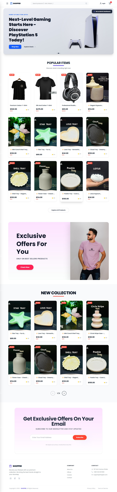
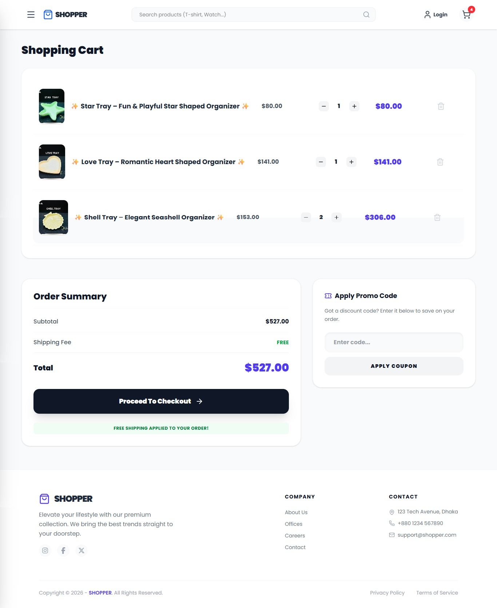
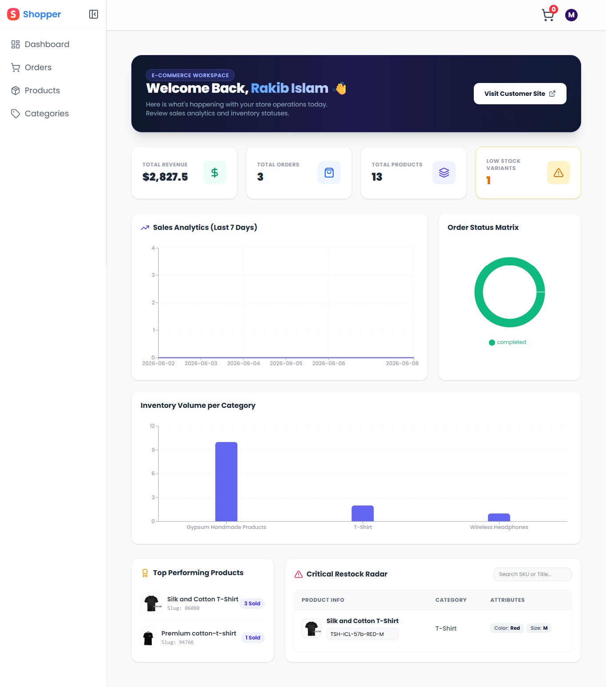
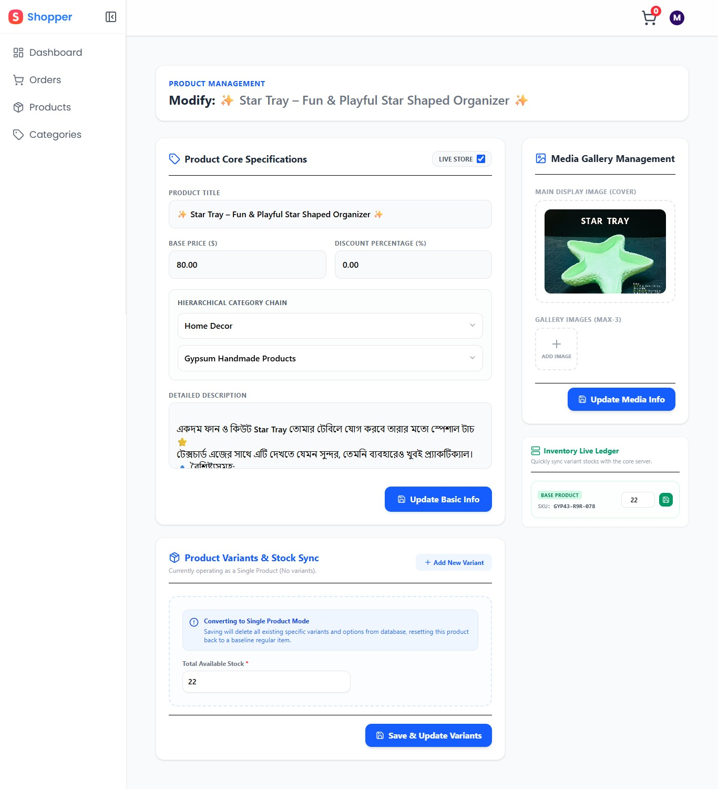
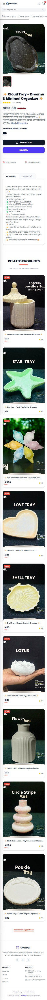
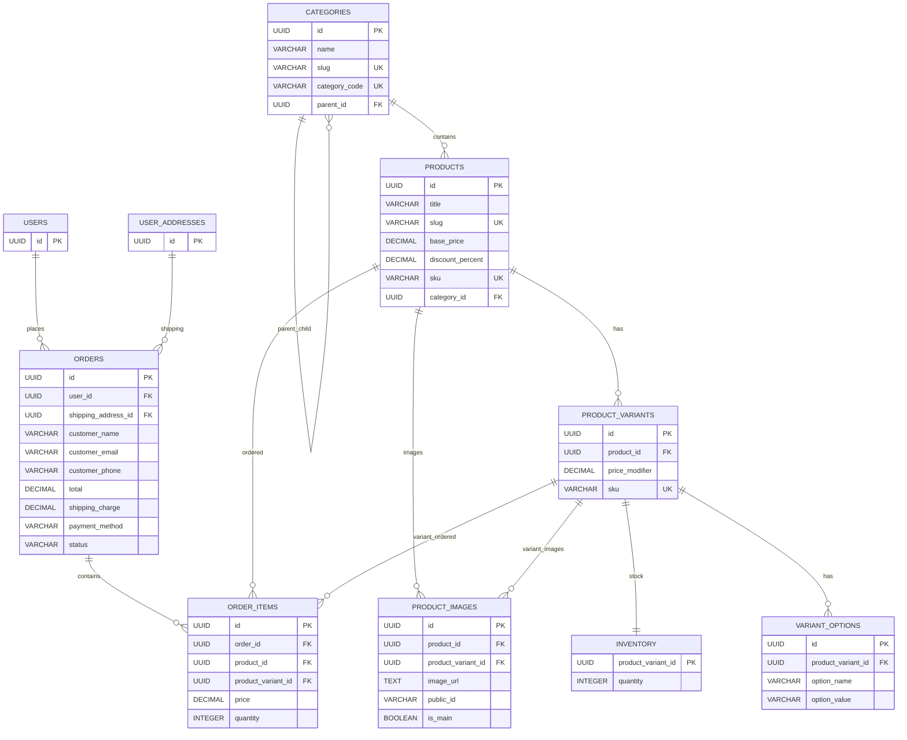

# 🛒 Shopper – Modern Mid-Scale E-Commerce Platform (MVP)

Shopper is a high-performance, single-store e-commerce application built with a production-grade **PERN** stack (PostgreSQL, Express, React, Node.js). It is engineered as a clean monorepo to solve critical e-commerce challenges such as infinite hierarchical nested categories, dynamic product variants, automated stock synchronization, and bulletproof relational data consistency.

---

## 🌐 Live Demo
- **Frontend:** [https://shahadat-ecommerce.netlify.app](https://shahadat-ecommerce.netlify.app)
- **Backend:** [https://e-commerce-server-ma9a.onrender.com](https://e-commerce-server-ma9a.onrender.com)

> **Note:** The server is hosted on a free Render tier. If it's inactive, please allow **30-60 seconds** for the initial server "cold start" to complete before interacting with the application.

---

## 📸 Screenshots

### 🖥️ Customer Storefront & Shopping Cart
<table>
  <tr>
    <td><b>Home Storefront</b></td>
    <td><b>Shopping Cart Experience</b></td>
  </tr>
  <tr>
    <td></td>
    <td></td>
  </tr>
</table>

### 📊 Admin Dashboard & Complex Inventory
<table>
  <tr>
    <td><b>Analytics & Workspace Dashboard</b></td>
    <td><b>Dynamic Variants & Stock Sync</b></td>
  </tr>
  <tr>
    <td></td>
    <td></td>
  </tr>
</table>

### 📱 Fully Responsive Mobile View
<p align="center">
  
</p>

---

## ✨ Key Features
### 🛍️ Comprehensive Storefront & Product Administration
* **Nested Categories:** Supports unlimited category levels using a parent-child category structure.
* **Product Variants:** Products can have multiple variants (e.g., Size, Color) with separate SKU, price adjustment, and inventory.
* **Inventory Management:** Supports both simple products and variant-based products with stock tracking.
* **Search & Filtering:** Category, search, sorting, and pagination are synchronized with URL parameters, allowing users to refresh or share filtered pages without losing state.
* **Guest Checkout:** Customers can place orders without creating an account.
* **State Management & Caching:** Uses Zustand for UI state and TanStack Query for server-state caching and automatic data refetching.
* **Responsive Design:** Fully responsive interface for desktop, tablet, and mobile devices.

---

### ⚙️ Technical Highlights

#### 1.Product & Variant Protection
Products and variants that are already used in customer orders cannot be removed accidentally.

Before deleting or updating product variants, the system checks related order records and prevents operations that would break historical order data.

#### 2.Database Transactions
Order creation is wrapped inside PostgreSQL transactions using:

```sql
BEGIN
COMMIT
ROLLBACK
```
If any step fails during checkout, all database changes are reverted to keep data consistent.

#### 3.Stock Validation & Race Condition Protection
Inventory updates use atomic SQL queries:
```sql
UPDATE inventory
SET quantity = quantity - $1
WHERE product_variant_id = $2
AND quantity >= $1;
```
This prevents overselling products when multiple customers place orders at the same time.

If stock is unavailable, the transaction is cancelled automatically.

#### 4.Invoice Printing
Administrators can print clean order invoices directly from the browser using CSS print media rules.

No external PDF generation library is required.

#### 5.Cloudinary Image Management
Product images are uploaded to Cloudinary.

If a database operation fails after uploading images, the application automatically removes unused files to prevent orphan storage.

#### 6.Automatic SKU & Slug Generation
The system automatically generates:

* **Unique product SKUs**
* **Variant SKUs**
* **SEO-friendly slugs**

This reduces manual data entry and avoids duplicate identifiers.

#### 7.URL-Based Filtering
Search, sorting, category filtering, and pagination are controlled through URL query parameters.

Pagination automatically resets when filters change, preventing invalid page states.

#### 8.File Upload Handling
Complex product data and multiple images are submitted together using FormData, allowing products and media to be processed in a single request.

#### 9.Cache Synchronization
TanStack Query automatically refreshes affected data after create, update, or delete operations.

This keeps the admin dashboard and storefront synchronized without requiring manual page refreshes.

---

## 🧠 Challenges & Learnings

### ⚡ Mastering Server-State & Cache Invalidation with TanStack Query
This project deeply advanced my expertise in asynchronous network data modeling using **TanStack Query (React Query)**:
- **Intelligent Queries & Mutations:** Leveraged explicit `useMutation` triggers to sync dynamic product variants, updates, or bulk data modifications asynchronously.
- **Strategic Cache Busting:** Mastered the workflow of cascading invalidations (`queryClient.invalidateQueries`). On modifying product metrics or updating a specific single stock cell, the system instantly broadcasts cache-bust instructions to sync the overall `products`, `dashboard-low-stock`, and unique product query sheets simultaneously, keeping data absolutely up-to-date.

### 🛡️ UX-Driven Cold Starts & Error Trapping
To ensure premium user experiences over free cloud limitations, I implemented several resilient UI/UX patterns:
- **Server Cold Start Defuses:** Since backend containers hosted on Render spin down during idle phases, I engineered an active blocking layer inside `App.jsx`. The application utilizes a global UI loading state that queries the server's `/health` endpoint upon mounting, keeping the screen cleanly locked until the container completes initialization.
- **Centralized Robust Errors:** Express backends incorporate structured, unified response objects via `http-errors`. On the frontend, Axios exceptions are trapped smoothly, converting server faults into user-friendly diagnostic toast notifications using **React Hot Toast**.

### 🔗 Hierarchical Dropdown UX Construction
Designing the interface for infinite nested category creation was a major technical milestone. Building an interactive, dynamic parent select chain requires active matrix filtration:
- **Recursive UI Pathways:** The frontend uses recursive child-filtering matching logic against the overall flat category stream, expanding selection trees instantly only when subsequent subcategories are detected.

### 📁 Monorepo Clean Architecture & Security
Managing a full decoupled monorepo structure across diverse production clouds (Netlify & Render) built vital knowledge about environment partitioning, strict CORS configurations, and database connection pooling safeguards.

---

## 🛠️ Tech Stack

### Frontend
- **React.js** (Vite Core Engine)
- **Tailwind CSS** (Fluid layout architecture)
- **TanStack Query (React Query)** (Server state caching & synchronization)
- **Zustand** (Local persistent state store with storage middleware)
- **Lucide React** (Consistent asset iconography)
- **React Router DOM & React Router Hash Link** (Declarative route mappings)
- **React Hot Toast & Swiper & Recharts** (Dynamic charts and toast streams)

### Backend
- **Node.js & Express.js** (Asynchronous ESM module architecture)
- **PostgreSQL (`pg` pool integration)** (Serverless infrastructure management)
- **Multer & Cloudinary SDK** (Direct asset stream file allocations)
- **Slugify & Http-Errors** (Route safety & validation utilities)

---

## 🗄️ Database Schema (PostgreSQL ER Diagram)


 ---  

 ## 📁 Project Structure Example (Monorepo)

 ```text
├── backend/               # Express API Engine
│   ├── config/            # DB Pools & Cloudinary stream setup
│   ├── src/
│   │   ├── controllers/   # Transactional core business engines
│   │   ├── routes/        # Isolated API end-routes
│   │   └── server.js      # Global application configuration
└── frontend/              # React Client Application (Vite-powered)
    ├── src/
    │   ├── components/    # Adaptive responsive UI modules
    │   ├── hooks/         # Custom TanStack query mutations
    │   ├── stores/        # Zustand persistence stores (Cart, UI)
    │   └── App.jsx        # Route registry and server wakeup trap
```

---
## 🚀 Installation & Local Setup

### 📋 Prerequisites
- **Node.js**: v18.x or higher
- **PostgreSQL**: Local cluster runtime or a remote Neon serverless DB instance
- **Git**: Installed on your machine

### 1. Clone the repository:
```bash
git clone https://github.com/muhammad-shahadat/e-commerce
cd e-commerce
```
### 2. Setup Backend
```bash
cd backend
npm install
```
#### Create a .env file inside the backend/ folder and insert your credentials:
```bash

PORT=3000
NODE_ENV=development

#Frontend & Backend Url
BACKEND_HEALTH_URL=your_backend_url(render)/health or http://localhost:3000/health
FRONTEND_BASE_URL=your_frontend_url(netlify) or http://localhost:5173

#neon sql connection string
DATABASE_URL=your_connection_string
#cloudinay connection string
CLOUDINARY_URL=your_connection_string
CLOUDINARY_FOLDER_NAME=ecommerce-assets

```

### 3. Create Database Schema

#### Before running the application, create all PostgreSQL tables, constraints, indexes, triggers, and relationships by executing the schema file:

```text
backend/
 └── config/
      ├── db.js
      └── dbSchema.sql
```

```bash
backend/config/dbSchema.sql
```

You can execute the file using:

#### PostgreSQL CLI
```bash
psql -d your_database_name -f backend/config/dbSchema.sql
```

#### Or using Neon SQL Editor
1. Open your Neon project dashboard.
2. Navigate to SQL Editor.
3. Copy the contents of `backend/config/dbSchema.sql`.
4. Execute the script.

After the schema is successfully created, verify that all tables exist.

### 4. Start Backend Server

```bash
npm start
```

### 5. Import Postman Collection
```text
e-commerce/
├── backend/
├── frontend/
├── postman/
│   └── Ecommerce.postman_collection.json
└── README.md
```
The API requests used for seeding and testing are available in:

```text
postman/Ecommerce.postman_collection.json
```

Import the collection into Postman:

1. Open Postman
2. Click Import
3. Select `postman/Ecommerce.postman_collection.json`
4. Run the requests

#### 📌 Testing Options:
- **1.🌐 Live Server** If you want to test against the live demo server instead of localhost, replace `http://localhost:3000` with `https://e-commerce-server-ma9a.onrender.com` in the request URLs. All API endpoints will work immediately without any local setup. (**Recommended**)
- **2.💻 Local Machine** If you want to test with localhost, keep `http://localhost:3000 ` (**Run backend locally + PostgreSQL + Cloudinary for file uploads**)


### 6. Seed Initial Data
**Prerequisite:** PostgreSQL schema must already be created.
#### Execute the following requests **in order** from Postman:

```text
Ecommerce/
├── productRoute/
│   ├── POST create product
│   ├── GET get all products
│   ├── GET get related products
│   ├── GET get single product
│   ├── PATCH Update Product Basic Info
│   ├── PATCH Sync Product Variants
│   └── PATCH Update Inventory
├── categoryRoute/
│   ├── GET get all categories
│   └── POST create category
├── orderRoute/
│   ├── POST create order
│   ├── GET get all orders with filtering
│   └── GET get single order
├── dashboardRoute/
│   ├── GET Get Dashboard Stats
│   └── GET Get Dashboard Charts
└── inventoryRoute/
    └── GET Get Low Stock Products
```
 
 
### 7. Setup Frontend
#### Split terminal and go back root dir using `cd ..` then run:
```bash
cd frontend
npm install
```
#### Create a .env file inside the frontend/ folder and add:
```bash
#Must use 'VITE_prefix' before the variable

VITE_BACKEND_BASE_URL=your_backend_url(render) or http://localhost:3000
VITE_BACKEND_HEALTH_URL=your_backend_url(render)/health or http://localhost:3000/health

#React Routing path urls
VITE_CUSTOMER_SITE_URL=your_frontend_url(netlify) or http://localhost:5173
VITE_ADMIN_SITE_URL=your_frontend_url(netlify)/admin or http://localhost:5173/admin
```
#### Then run the frontend:
```bash
npm run dev
```
---

## 🛠️ Troubleshooting
- **Server Delay (Cold Start):** As this project is hosted on Render's free tier, the first request might take **30-60 seconds** to wake up the server. Subsequent requests will be much faster.
- **SQL Injection Defenses:** The data infrastructure rejects directly concatenated inputs, executing queries entirely via native parameterized pools ($1, $2). Double-check parameter bindings if customized update queries fail execution.
- **CORS Issues:** If you encounter CORS errors locally, verify that your `.env` file in the backend directory has the correct `FRONTEND_BASE_URL` (e.g., `http://localhost:5173`).

---

## 👨‍💻 Author
### Shahadat Hossain
- **GitHub:** [https://github.com/muhammad-shahadat](https://github.com/muhammad-shahadat)
- **Email:** [shahadat6640@gmail.com](mailto:shahadat6640@gmail.com)

---
